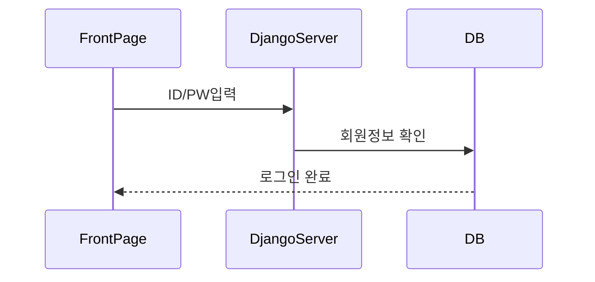
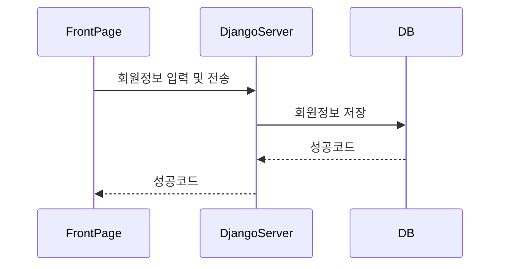
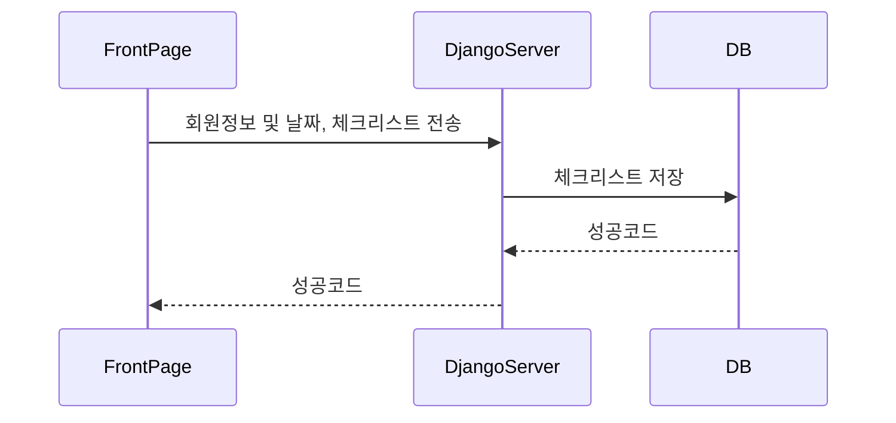
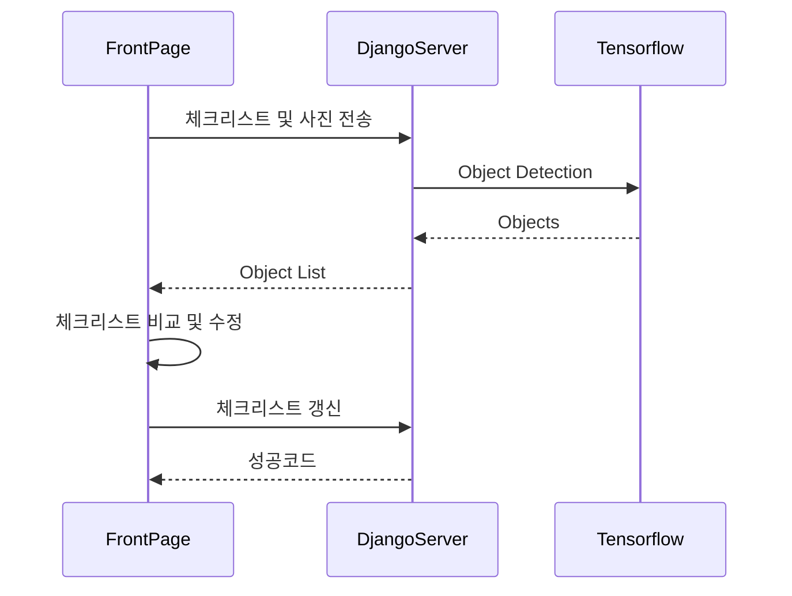

# Pack-Man

## 1. 로그인

로그인은 간단하게 ID, PW 입력을 통해 DB를 확인하여 로그인을 진행

## 2. 회원가입

E-mail을 ID로 사용하여 회원가입 진행

## 3. 체크리스트 조회

달력에서 날짜 선택 후 저장된 체크리스트 불러오기

## 4. 체크리스트 저장

달력에서 날짜 선택 후 새로운 체크리스트 생성

## 5. 체크리스트 비교

- 체크리스트 선택 후 물건들의 사진을 바탕으로 생성된 체크리스트와 비교
- 체크리스트 수정 후 갱신

