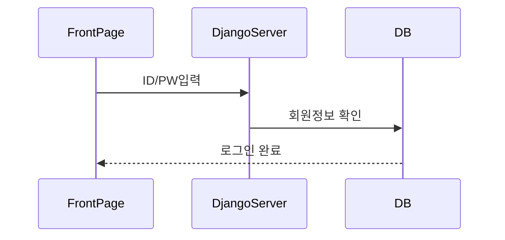
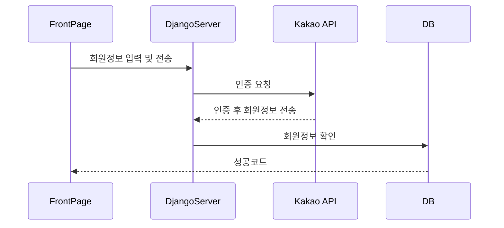
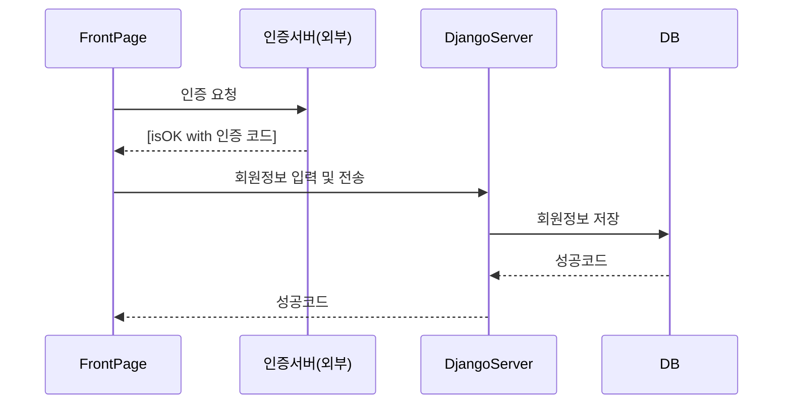
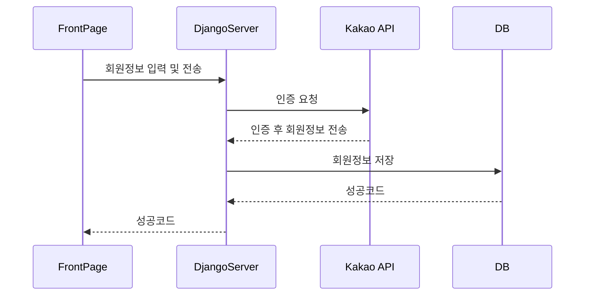
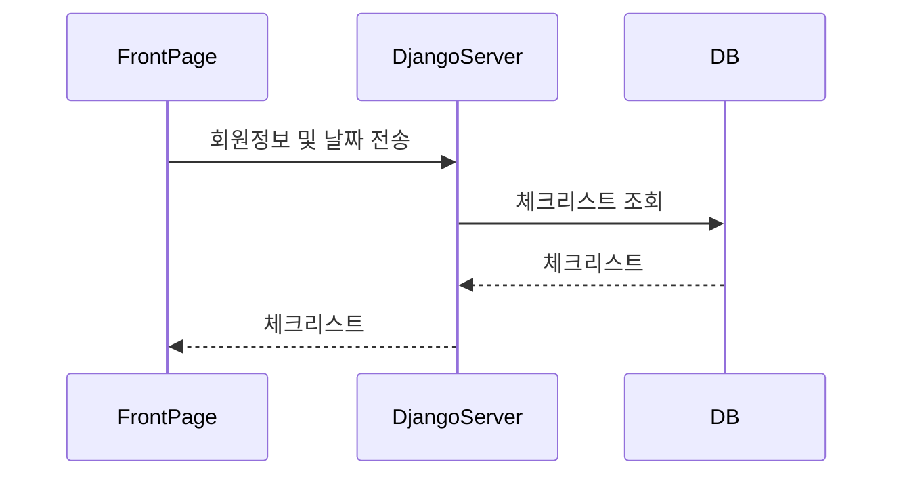
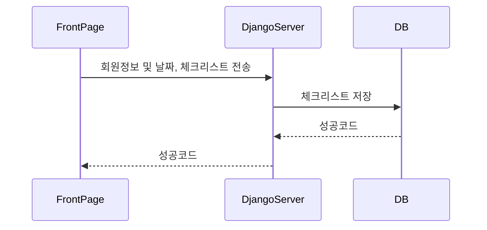
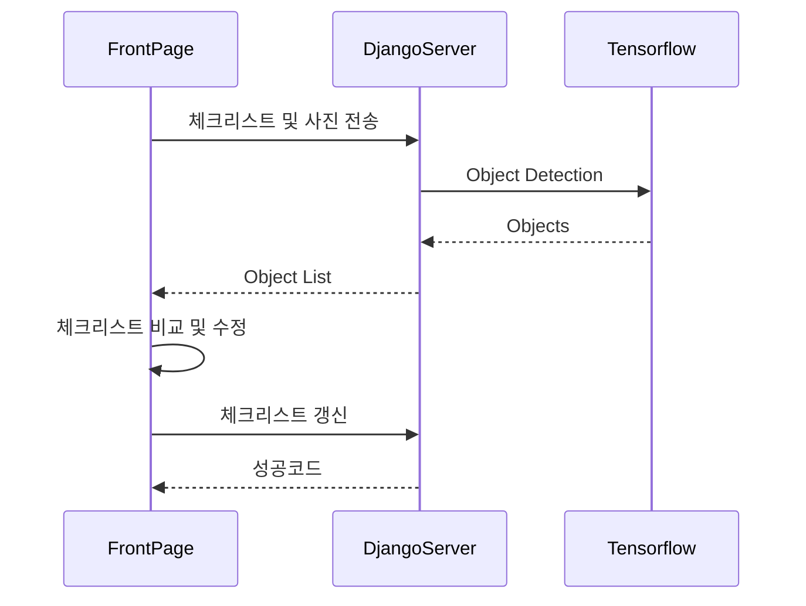

# Pack-Man

## 1. 로그인

로그인은 간단하게 ID, PW 입력을 통해 DB를 확인하여 로그인을 진행

## 2. 카카오 로그인

카카오 API와의 통신을 통해 카카오에서 제공하는 회원 정보를 DB에서 확인한 후 로그인 

## 3. 회원가입

E-mail을 ID로 사용할 예정이므로 이메일 인증을 거친 후 회원가입 진행

## 4. 카카오 회원가입

카카오 API와의 통신을 통해 카카오에서 제공하는 회원 정보를 DB에 저장

## 5. 체크리스트 조회

달력에서 날짜 선택 후 저장된 체크리스트 불러오기

## 6. 체크리스트 저장

달력에서 날짜 선택 후 새로운 체크리스트 생성

## 7. 체크리스트 비교

- 체크리스트 선택 후 물건들의 사진을 바탕으로 생성된 체크리스트와 비교
- 체크리스트 수정 후 갱신

